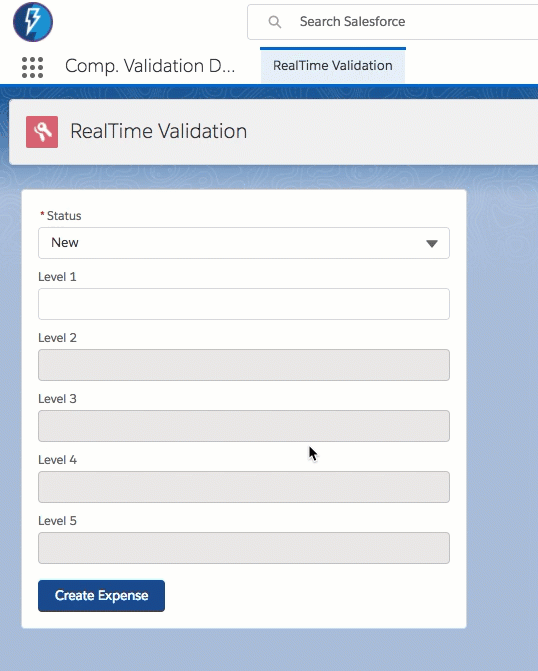
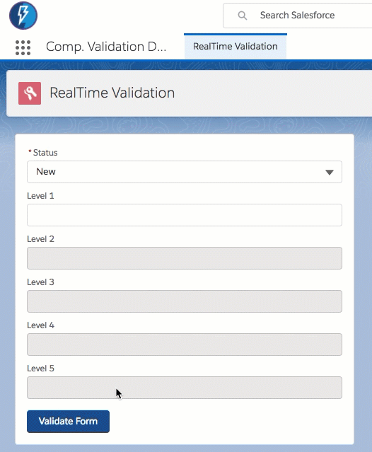

# Quick Demo of using realtime validation

**Please note: sample code (metadata api and dx formats) are available in the [mdapi](./mdapi) and [dx](./dx) folders above**

## Demo

In this validation, we do not require Validation Rules (as they compare only when sent to the server), but we want to make fields enabled or required as you use them.

Please see

* [Input Data Using Forms - Trailhead Module](https://trailhead.salesforce.com/modules/lex_dev_lc_basics/units/lex_dev_lc_basics_forms)
* [Performing Validation - Trailhead Module](https://trailhead.salesforce.com/modules/lex_dev_lc_basics/units/lex_dev_lc_basics_forms#Tdxn4tBKheading7)
* [lightning:inputField - Lightning Components Developer Guide](https://developer.salesforce.com/docs/atlas.en-us.lightning.meta/lightning/aura_compref_lightning_inputField.htm?search_text=lightning:inputField)
* [Adding css classes](https://developer.salesforce.com/docs/atlas.en-us.lightning.meta/lightning/js_cb_styles.htm)

## TLDR How

You can mark components required at runtime by setting the `v.required` attribute

	ex:
	component.find(levelName).set("v.required", true);

You can make components enabled or not based on setting `v.disabled` attribute:
[See the helper for more details](dx/force-app/main/default/aura/ltng_RealtimeValidation/ltng_RealtimeValidationHelper.js)

	ex:
	component.find(levelName).set("v.disabled", isLocked);

[See here for more on validating forms](https://trailhead.salesforce.com/modules/lex_dev_lc_basics/units/lex_dev_lc_basics_forms#Tdxn4tBKheading7)

[And additional breakdown of what exactly that means here](https://salesforce.stackexchange.com/questions/184525/help-me-to-undestand-this-lightning-helper-methods-reduce-showhelpmessageifin#answer-184535)

Additional documentation [found here](https://developer.salesforce.com/docs/atlas.en-us.lightning.meta/lightning/js_validate_fields.htm)

If push comes to shove, you can always add in Lightning Design System classes, through  [See Here for more details](https://developer.salesforce.com/docs/atlas.en-us.lightning.meta/lightning/js_cb_styles.htm)

	ex:
	$A.util.addClass(component.find('level1'), 'slds-required');

---

# Quick Demo of using inputField and CSS for validation  (when push comes to shove)

## Demo
Graphics coming soon

## Approach

In order to use the inputField approach you will need
1. A few custom CSS classes
2. aura:doneRendering event
3. JavaScript magic

### CSS classes

Many lightning components are not a single HTML element in the final browser markup. In order to apply a 'disabled' look to only the input a CSS selector approach is used. Case in point, see the class '.THIS .custom-disabled input' below. There is no v.disabled property to set in a lightning:inputField. 

Required and disabled behaviors require custom classes which borrow from the style guide, but the error class can be used directly from the lightning design system by applying 'slds-has-error' which you can read more about [here](https://developer.salesforce.com/docs/atlas.en-us.lightning.meta/lightning/js_cb_styles.htm).

	ex:
	.THIS  
	{  
	
	}  
	.THIS .custom-required  
	{  
		font-weight: 400;  
	}  
	.THIS .custom-required:before  
	{  
		content: "*";  
		margin: 0 0.125rem 0 0.125rem;  
		color: rgb(194, 57, 52);  
		float: left;  
	}  
	.THIS .none  
	{  
		display:none;  
	}  
	.THIS .custom-disabled input  
	{ 
		background-color: rgb(242, 242, 242);  
		color: rgb(110,110,110);  
		cursor: not-allowed;  
	}  

### aura:doneRendering - when is it necessary?

To successfully apply styles on an initial load using the util class like this: $A.util.addClass(component.find('level1'), '.slds-required'); we need to apply them late enough in the game. Meet our friend doneRendering which can help use do things like disable fields on an initial load state.

#### Aura markup for aura:doneRendering

Here is a basic example of how to apply the doneRendering to markup:

	ex:
	<aura:attribute name="doneRenderingIsComplete" type="Boolean" default="false" />  
	<!-- handlers -->  
	<aura:handler name="init" value="{!this}" action="{!c.init}" />  
	<!-- The aura:doneRendering event is needed to set the state of individual DOM elements on the  
		initial load when they are not available in the init phase -->  
	<aura:handler event="aura:doneRendering" action="{!c.doneRendering}"/>  

#### Controller Code in .js file for aura:doneRendering

_NOTE_: The check on "v.doneRenderingIsComplete" is necessary to prevent an infinite loop. [See here for more details about doneRendering](https://developer.salesforce.com/docs/atlas.en-us.lightning.meta/lightning/ref_aura_doneRendering.htm for more details)

	ex:
	//Needed to emulate an initial load state of disabled
	doneRendering : function (component, event, helper)
	{
		if(component.get("v.doneRenderingIsComplete") === false)
		{
			//Set this first thing to prevent any potential racing or looping
			component.set("v.doneRenderingIsComplete", true);
			console.info("doneRendering ran");
			//TODO: Do something like this: $A.util.addClass(component.find('level1'), 'custom-disabled');
		}
	},

## Can I see just the CSS/style pieces in action?

Check out the tab in the demo app called 'Validation Test' (installation instructions below). This provides a simple example of toggling styles for disabled/required/error states and shows you some boilerplate JS code suitable for expansion.

## Styles look good but how is validation going to happen?

This is where JS magic and your imagination comes in. If you look at the second tab called 'Input Field Val.' this is a style based approach which emulates the real-time demo but uses lightning:inputField instead of lightning:input components. 

---

# Demo code overview

The metadata for this example can be found under the [mdapi](./mdapi) folder.

The Salesforce CLI version of this code can be found under the [dx](./dx) folder.

## Installing via the Salesforce CLI

This assumes you have already installed the [Salesforce CLI]() and [Connected the Salesforce CLI to your org](https://developer.salesforce.com/docs/atlas.en-us.sfdx_dev.meta/sfdx_dev/sfdx_dev_auth_web_flow.htm).

However, the Salesforce CLI can be used with any org and does not require Salesforce DX to be enabled. (Although enabling the DX / Dev Hub would give some great benefits, and would only require care of [certain object permissions: Scratch Org Info, ActiveScratchOrg, NamespaceRegistry](https://developer.salesforce.com/docs/atlas.en-us.sfdx_setup.meta/sfdx_setup/sfdx_setup_add_users.htm) - as they are not available in all orgs)

**1.** Run the following command:

	sfdx force:mdapi:deploy -d mdapi -u [[orgAlias]] -w

**2.** Add the permission set to your user

	sfdx force:user:permset:assign -n requiredLightningComponentDemo -u [[orgAlias]]
	
...

Thats it, you can now open the org, and find the 'Comp. Validation Demo' app in the 'all tabs' search.

	sfdx force:org:open -u [[orgAlias]]

